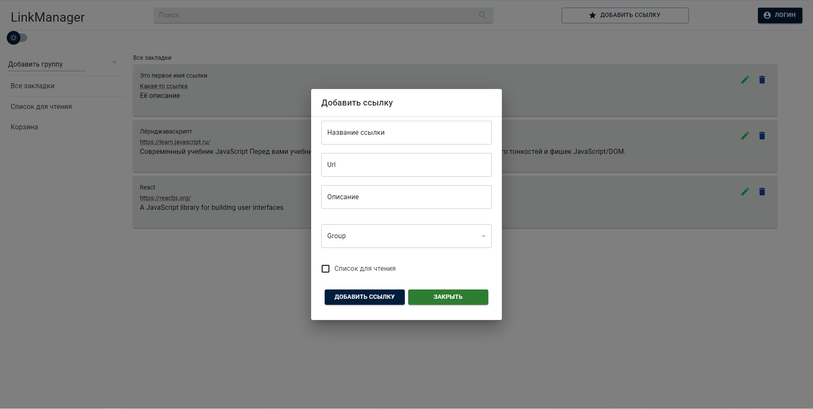

# link-manager-deployVersion

# **Менеджер закладок**
***

Менеджер позволяет сохранять определённые сайты с Вашим описанием, также есть возможность редактирования сохранённых сайтов и их удаления, если это необходимо.
В функционале сайта можно выполнить поиск сохранённых ранее ссылок с помощью поля поиска

Доступно 2 варианта дизайна сайта (светлый/тёмный)

## Технологии используемые в проекте:
### * React(функциональный подход)
### * Redux(Redux Toolkit)
### * Prettier
### * TypeScript
### * Material UI
### * Модальные окна(валидация).

В дальнейшем проект планируется дорабатывать расширенным функционалом.

Ссылка на версию разработки проекта: [перейти в репозиторий разработки](https://github.com/EvelinaShchigortseva/link-manager)
